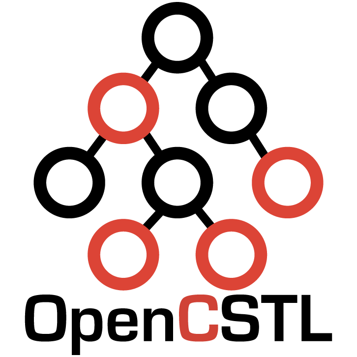

### 


## Open source C container library like C++ STL

### Features
* Support [ ] operator
	* `cstl_vector` and `cstl_deque` can use [ ] to access element.
* Same interface with C++ STL.
	* OpenCSTL has a function name and parameters such as C++ STL.
	* You just need passing `container` to first parameter.
* Overloading in C
	* We implement overloading function as variadic grammar.
* Fast performance
	* OpenCSTL doesn't have bootleneck.
* Crossplatform
	* OpenCSTL support `MSVC`, `MinGW64`, `Linux gcc`.
* Header only library
	* You just need include `opencstl/opencstl.h`.


### Example
#### `vector example`
```cpp
void vector_example(){
    int* arr = cstl_vector(int);	    //Create vector.
    cstl_push_back(arr,88);			    //Append(push_back) (literal) into vector.
    for (int i = 0; i < 10; i++) {
        cstl_push_back(arr, i);		    //Append(push_back) (variable) into vector.
    }
    cstl_pop_back(arr);				    //pop_back
    cstl_insert(arr, arr + 0, 777);	    //Insert 777 into the 0th.
    cstl_insert(arr, arr + 5, 5,999);	//Insert 999 5 times into the 5th.
    cstl_erase(arr, arr + 3, arr+5);	//Erase elements from 3rd to 4th

    cstl_resize(arr, 15, -1);           //Resize vector size to 15.

    //Print each element using iterator.
    for (int* it = cstl_begin(arr); it != cstl_end(arr); it++) {
        printf("[%3d] ", *it);
    }
    puts("");

    int* pos = cstl_find(arr, 7);       //Find 7 in vector
    if(pos!=NULL)
        printf("find : [%3d]\n", *pos);
    cstl_free(arr);						//Memory release
}
```
#### `list example`
```cpp
void list_example(){
    int** list = cstl_list(int);		//Create list.
    for (int i = 0; i < 10; i++) {
        cstl_push_back(list, i);		//Append(push_back) into list.
    }
    cstl_pop_back(list);
    cstl_insert(list, cstl_begin(list), 777);		//Insert 777 into the 0th.
    cstl_insert(list, cstl_find(list,4), 5, 999);	//Insert 999 5 times before 4(element).
    cstl_erase(list, cstl_find(list, 2), cstl_find(list, 999));		//Erase elements from 2 to 999(first).
    //Print each element using iterator.
    for (int* it = cstl_begin(list); it != cstl_end(list); it = cstl_next(it)) {
        printf("[%3d] ", *it);
    }
    puts("");
    cstl_free(list);		//Memory release
}
```
#### `set example`
```cpp
//Same as qsort compare function.
int IntCmp(const void* a, const void* b) {
	return *(int*)a < *(int*)b ? -1 : *(int*)a > *(int*)b;
}
void set_example(){
	int** tree = cstl_set(int, IntCmp);		//Create set
	for (int i = 0; i < 100; i++) {
		cstl_insert(tree,i);				//Insert value into set.
	}
	for (int i = 50; i < 70; i++) {
		int* it = cstl_find(tree, i);		//Find iterator
		cstl_erase(tree, it);				//Erase (50,70] from set.
	}
	//Print each element using iterator.
	for (int* it = cstl_begin(tree); it != cstl_end(tree); it = cstl_next(it)) {
		printf("[%3d]", *it);
	}
	puts("");
	cstl_free(tree);	//Memory release
}
```
#### `map example`
```cpp
//Same as qsort compare function.
int IntCmp(const void* a, const void* b) {
	return *(int*)a < *(int*)b ? -1 : *(int*)a > *(int*)b;
}
void map_example(){
	float** tree = cstl_map(float, double,IntCmp);
	for (int i = 0; i < 10; i++) {
    	float f = (float)i;
		double d = (double)i;
		cstl_insert(tree, f,d*d);	//@Warning do not insert other(simular) type.
	}
	for (int* it = cstl_begin(tree); it != cstl_end(tree); it = cstl_next(it)) {
		printf("[%3d]{%.3f} ", *it,cstl_value(it,double));
	}
	puts("");
	cstl_free(tree);
}
```
#### `deque example`
```cpp
void deque_example(){
	int* deque = cstl_deque(int);
	for (int i = 0; i < 10; i++) {
		cstl_push_back(deque, i);
	}
	for (int i = 0; i < 10; i++) {
		cstl_push_front(deque, i);
	}
	for(int i=0;i<cstl_size(deque);i++){
		printf("%d ", deque[i]);
	}
	puts("");
	cstl_free(deque);
}
```
### Reference
#### `vector references`
```
<type*> cstl_vector(<type>);
<type*> cstl_begin(<vector>);
<type*> cstl_end(<vector>);
void cstl_clear(<vector>);
bool cstl_empty(<vector>);					//Not implemented
<type*> cstl_find(<vector>,<iter>,<value>);
<type*> cstl_find(<vector>,<value>);
<type> cstl_front(<vector>)					//Not implemented
<type> cstl_back(<vector>)					//Not implemented
void cstl_erase(<vector>,<iter>);
void cstl_erase(<vector>,<iter_begin>,<iter_end>);
void cstl_insert(<vector>,<iter>,<value>);
void cstl_insert(<vector>,<iter>,<N>,<value>);
void cstl_pop_back(<vector>);
void cstl_push_back(<vector>,<value>);
<type*> cstl_rbegin(<vector>);
<type*> cstl_rend(<vector>);
void cstl_size(<vector>);
void cstl_resize(<vector>,<N>);
void cstl_resize(<vector>,<N>,<value>);
void cstl_free(<vector>);
```
#### `list references`
```
<type**> cstl_list(<type>);
<type*> cstl_begin(<list>);
<type*> cstl_end(<list>);
void cstl_clear(<list>);
bool cstl_empty(<list>);					//Not implemented
<type*> cstl_find(<list>,<iter>,<value>);
<type*> cstl_find(<list>,<value>);
<type> cstl_front(<list>)					//Not implemented
<type> cstl_back(<list>)					//Not implemented
void cstl_erase(<list>,<iter>);
void cstl_erase(<list>,<iter_begin>,<iter_end>);
void cstl_insert(<list>,<iter>,<value>);
void cstl_insert(<list>,<iter>,<N>,<value>);
void cstl_pop_back(<list>);
void cstl_push_back(<list>,<value>);
void cstl_pop_front(<list>);
void cstl_push_front(<list>,<value>);
<type*> cstl_rbegin(<list>);
<type*> cstl_rend(<list>);
void cstl_size(<list>);
void cstl_resize(<list>,<N>);				//Not implemented
void cstl_resize(<list>,<N>,<value>);		//Not implemented
void cstl_free(<list>);
```
### `set references`
```
<type**> cstl_set(<type>);
<type*> cstl_begin(<set>);
<type*> cstl_end(<set>);
void cstl_clear(<set>);
bool cstl_empty(<set>);					//Not implemented
<type*> cstl_find(<set>,<value>);
void cstl_erase(<set>,<iter>);
void cstl_insert(<set>,<iter>,<value>);
<type*> cstl_rbegin(<set>);
<type*> cstl_rend(<set>);
void cstl_size(<set>);					//Not implemented
void cstl_free(<set>);
<type*> cstl_next(<iter>);
<type*> cstl_prev(<iter>);
```
### `map references`
```
<type**> cstl_map(<type>);
<type*> cstl_begin(<map>);
<type*> cstl_end(<map>);
void cstl_clear(<map>);
bool cstl_empty(<map>);					//Not implemented
<type*> cstl_find(<map>,<value>);
void cstl_erase(<map>,<iter>);
void cstl_insert(<map>,<iter>,<value>);
<type*> cstl_rbegin(<map>);
<type*> cstl_rend(<map>);
void cstl_size(<map>);					//Not implemented
void cstl_free(<map>);
<type*> cstl_next(<iter>);
<type*> cstl_prev(<iter>);
<type> cstl_value(<iter>,<type>);
```
### `deque references`
```
<type*> cstl_deque(<type>);
<type*> cstl_begin(<deque>);
<type*> cstl_end(<deque>);
void cstl_clear(<deque>);
bool cstl_empty(<deque>);					//Not implemented
<type*> cstl_find(<deque>,<iter>,<value>);
<type*> cstl_find(<deque>,<value>);
<type> cstl_front(<deque>)					//Not implemented
<type> cstl_back(<deque>)					//Not implemented
void cstl_erase(<deque>,<iter>);
void cstl_erase(<deque>,<iter_begin>,<iter_end>);
void cstl_insert(<deque>,<iter>,<value>);
void cstl_insert(<deque>,<iter>,<N>,<value>);
void cstl_pop_back(<deque>);
void cstl_push_back(<deque>,<value>);
void cstl_pop_front(<deque>);
void cstl_push_front(<deque>,<value>);
<type*> cstl_rbegin(<deque>);
<type*> cstl_rend(<deque>);
void cstl_size(<deque>);
void cstl_resize(<deque>,<N>);				//Not implemented
void cstl_resize(<deque>,<N>,<value>);		//Not implemented
void cstl_free(<deque>);
```
### Warnings
* Unable to recognize typedef float
	* OpenCSTL is based on variadic function. 
	* Basically it can handle char,short,int,int64,double and struct. 
	* But we made this can handle float too. 
	* But other float name can't be handle.
* Array based structure use <type*>, Node based structure use <type**>.

