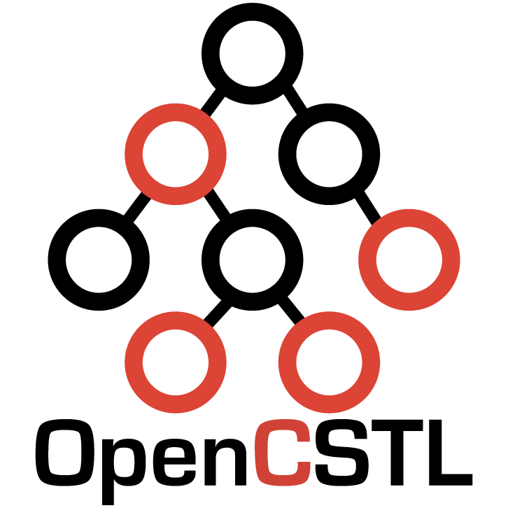
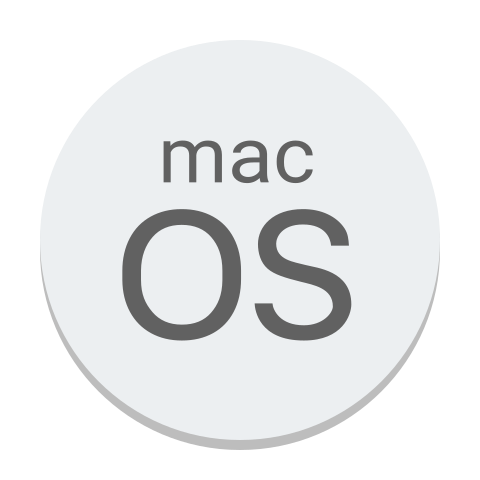

<p align="center">
  
</p>

# OpenCSTL
## STL for C — Single-header container library in pure C

## Why OpenCSTL?

- **Single-header**
  - Just `#include "opencstl.h"` and you're done. No build steps, no linking.

- **Identical C++ STL interface**
  - Same function names, same semantics, zero new API to learn.
  - Auto-dispatch: one function name routes to the correct implementation based on the container type.
  - Variadic API: different parameter counts invoke different behaviors, just like C++ overloading.

- **Bracket access**
  - `vector` and `deque` support `v[i]` subscript access, just like C++ and plain C arrays.

- **Full iterator support**
  - Every container exposes `begin`, `end`, `rbegin`, and `rend` iterators.

- **stdlib compatible**
  - Use standard C functions like `qsort` and `bsearch` directly on container data.

- **Zero boilerplate**
  - No forward declarations, no type registration macros, no initialization ceremony.

- **Cross-platform**
  - Works on Windows, macOS, and Linux.
  - Compiler support: MSVC, MinGW64, GCC, Clang, and icx-cc.

- **Simpler than any alternative**
  - Far easier to use than other C container libraries, without breaking idiomatic C style.

## Installation
```bash
curl -LO "https://raw.githubusercontent.com/springkim/OpenCSTL/refs/heads/master/opencstl.h"
```

## Supported Platforms

<p align="center">
    
    
    
</p>

<p align="center">
    
    
    
    
    
    
</p>


| C Compiler                      | Windows | macOS | Linux |
|---------------------------------|:-------:|:-----:|:-----:|
| MSVC (cl)                       | ✅      |       |       |
| GNU (gcc)                       | ✅      | ✅    | ✅    |
| LLVM (clang)                    | ✅      | ✅    | ✅    |
| TCC                             | ✅      | ❌    | ❌    |
| Intel oneAPI DPC++/C++ Compiler |         | ❌    | ✅    |

## Example
```c
#include "opencstl.h"
#include <stdlib.h>

int cmp_int(const void *a, const void *b) {
    return *((int *) a) - *((int *) b);
}

void example_deque() {
    DEQUE(int) q = new_deque(int);

    for (int i = 0; i < 10; i++) {
        push_back(q, rand32() % 100);
    }

    insert(q, q + 5, 777);    // Insert 777 at position 5
    insert(q, q + 8, 3, 999); // Insert three 999s at position 8

    for (int i = 0; i < size(q); i++) {
        printf("[%3d]", q[i]); // [] access, just like a plain C array
    }
    puts("");

    qsort(q, size(q), sizeof(int), cmp_int); // Works with standard C functions

    for (int i = 0; i < size(q); i++) {
        printf("[%3d]", q[i]);
    }
    puts("");

    destroy(q);
}

int main() {
    example_deque();
    return 0;
}
```

**Output:**
```
[ 38][ 26][ 13][ 83][ 19][777][ 95][ 78][999][999][999][ 87][ 80][ 86]
[ 13][ 19][ 26][ 38][ 78][ 80][ 83][ 86][ 87][ 95][777][999][999][999]
```

## Reference

### `vector`
```
VECTOR(<type>) v = new_vector(<type>);
<type*> begin(<vector>);
<type*> end(<vector>);
<type*> rbegin(<vector>);
<type*> rend(<vector>);
size_t  size(<vector>);
bool    empty(<vector>);
<type>  front(<vector>);
<type>  back(<vector>);
void    push_back(<vector>, <value>);
void    pop_back(<vector>);
void    insert(<vector>, <iter>, <value>);
void    insert(<vector>, <iter>, <N>, <value>);
void    erase(<vector>, <iter>);
void    erase(<vector>, <iter_begin>, <iter_end>);
<type*> find(<vector>, <value>);
<type*> find(<vector>, <iter>, <value>);
void    resize(<vector>, <N>);
void    resize(<vector>, <N>, <value>);
void    assign(<vector>, <N>);
void    assign(<vector>, <N>, <value>);
void    clear(<vector>);
void    destroy(<vector>);
```

### `list`
```
LIST(<type>) l = new_list(<type>);
<type*> begin(<list>);
<type*> end(<list>);
<type*> rbegin(<list>);
<type*> rend(<list>);
<type*> next(<iter>);
<type*> prev(<iter>);
size_t  size(<list>);
bool    empty(<list>);
<type>  front(<list>);
<type>  back(<list>);
void    push_back(<list>, <value>);
void    pop_back(<list>);
void    push_front(<list>, <value>);
void    pop_front(<list>);
void    insert(<list>, <iter>, <value>);
void    insert(<list>, <iter>, <N>, <value>);
void    erase(<list>, <iter>);
void    erase(<list>, <iter_begin>, <iter_end>);
<type*> find(<list>, <value>);
<type*> find(<list>, <iter>, <value>);
void    resize(<list>, <N>);
void    resize(<list>, <N>, <value>);
void    assign(<list>, <N>);
void    assign(<list>, <N>, <value>);
void    clear(<list>);
void    destroy(<list>);
```

### `deque`
```
DEQUE(<type>) q = new_deque(<type>);
<type*> begin(<deque>);
<type*> end(<deque>);
<type*> rbegin(<deque>);
<type*> rend(<deque>);
size_t  size(<deque>);
bool    empty(<deque>);
<type>  front(<deque>);
<type>  back(<deque>);
void    push_back(<deque>, <value>);
void    pop_back(<deque>);
void    push_front(<deque>, <value>);
void    pop_front(<deque>);
void    insert(<deque>, <iter>, <value>);
void    insert(<deque>, <iter>, <N>, <value>);
void    erase(<deque>, <iter>);
void    erase(<deque>, <iter_begin>, <iter_end>);
<type*> find(<deque>, <value>);
<type*> find(<deque>, <iter>, <value>);
void    resize(<deque>, <N>);
void    resize(<deque>, <N>, <value>);
void    assign(<deque>, <N>);
void    assign(<deque>, <N>, <value>);
void    clear(<deque>);
void    destroy(<deque>);
```

### `set`
```
SET(<type>) s = new_set(<type>, <comparator>);
<type*> begin(<set>);
<type*> end(<set>);
<type*> rbegin(<set>);
<type*> rend(<set>);
<type*> next(<iter>);
<type*> prev(<iter>);
size_t  size(<set>);
bool    empty(<set>);
void    insert(<set>, <value>);
void    erase(<set>, <iter>);
<type*> find(<set>, <value>);
void    clear(<set>);
void    destroy(<set>);
```

### `map`
```
MAP(<key_type>, <value_type>) m = new_map(<key_type>, <value_type>, <comparator>);
<key_type*> begin(<map>);
<key_type*> end(<map>);
<key_type*> rbegin(<map>);
<key_type*> rend(<map>);
<key_type*> next(<iter>);
<key_type*> prev(<iter>);
size_t      size(<map>);
bool        empty(<map>);
void        insert(<map>, <key>, <value>);
void        erase(<map>, <iter>);
<key_type*> find(<map>, <key>);
<value_type> value(<iter>, <value_type>);
void        clear(<map>);
void        destroy(<map>);
```

### `stack`
```
STACK(<type>) s = new_stack(<type>);
size_t size(<stack>);
bool   empty(<stack>);
<type> top(<stack>);
void   push(<stack>, <value>);
void   pop(<stack>);
void   clear(<stack>);
void   destroy(<stack>);
```

### `queue`
```
QUEUE(<type>) q = new_queue(<type>);
size_t size(<queue>);
bool   empty(<queue>);
<type> front(<queue>);
<type> back(<queue>);
void   push(<queue>, <value>);
void   pop(<queue>);
void   clear(<queue>);
void   destroy(<queue>);
```

### `priority_queue`
```
PRIORITY_QUEUE(<type>) pq = new_priority_queue(<type>, <comparator>);
size_t size(<priority_queue>);
bool   empty(<priority_queue>);
<type> top(<priority_queue>);
void   push(<priority_queue>, <value>);
void   pop(<priority_queue>);
void   clear(<priority_queue>);
void   destroy(<priority_queue>);
```

## Notes

- `float` is supported, but `typedef`-aliased float types are not recognized.
  Stick to the `float` keyword directly.
- Sequence containers (`vector`, `deque`) use `<type*>` as the handle type.
  Node-based containers (`list`, `set`, `map`) use `<type**>`.

## Links

[](https://hypercommit.com/opencstl)


