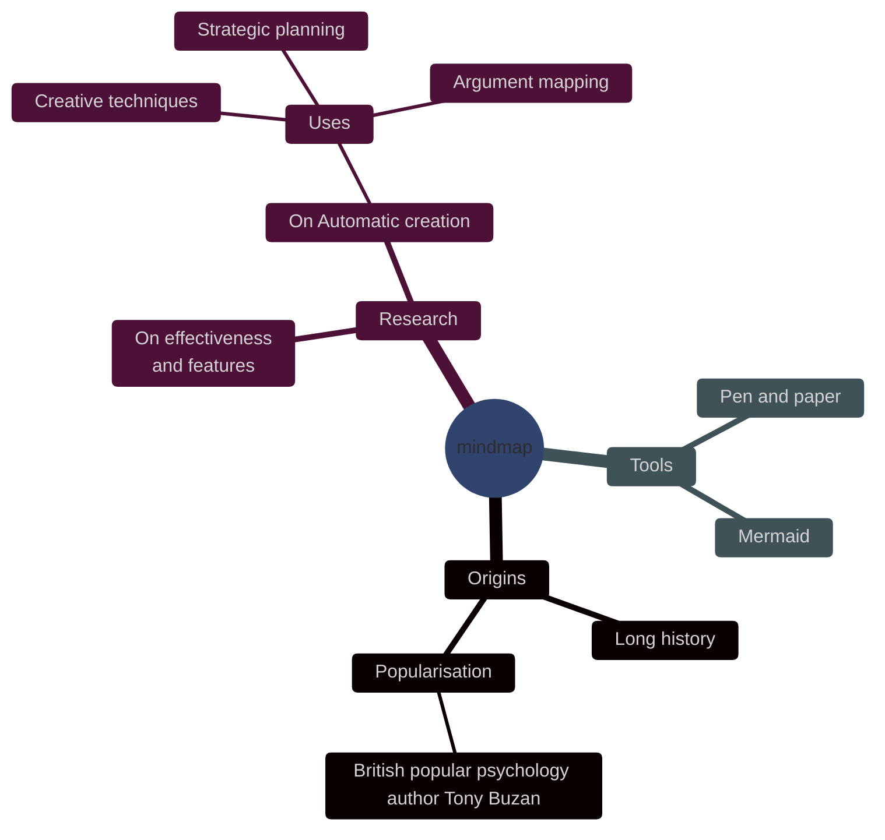

## TODO

 - [x] Bitset
 - [x] String

```mermaid
mindmap
  root(("mindmap"))
    Origins
      Long history
      ::icon(fa fa-book)
      Popularisation
        British popular psychology author Tony Buzan

    Research
      On effectiveness<br/>and features
      On Automatic creation
        Uses
          Creative techniques
          Strategic planning
          Argument mapping

    Tools
      Pen and paper
      Mermaid

%%{init: {
  "theme": "dark",
  "themeVariables": {
    "primaryColor": "#1f2937",
    "primaryTextColor": "#f9fafb",
    "primaryBorderColor": "#60a5fa",
    "lineColor": "#93c5fd",
    "secondaryColor": "#111827",
    "tertiaryColor": "#0f172a",
    "background": "#0b1120",
    "mainBkg": "#1e293b",
    "secondBkg": "#111827",
    "tertiaryBkg": "#0f172a",
    "textColor": "#f8fafc"
  }
}}%%
```

